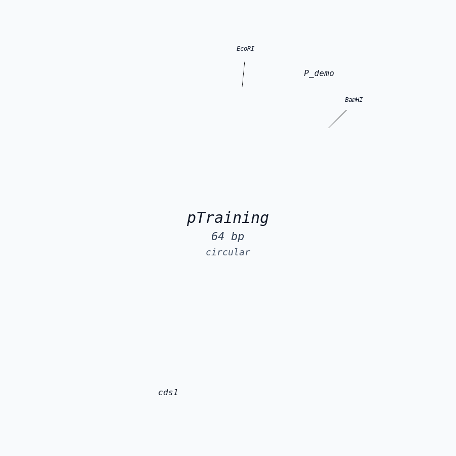

# Genome Forge

Genome Forge is a local-first DNA design, cloning, validation, and visualization workbench for molecular biology teams.

It combines:

- a Python sequence engine
- a browser-based web UI
- reproducible regression suites
- training materials and workflow examples



## What It Covers

Genome Forge is built for practical sequence work across:

- plasmid mapping and feature annotation
- restriction digest planning and cloning simulation
- primer design, PCR, and mutagenesis workflows
- alignment, trace review, and construct verification
- CRISPR helper workflows
- reference libraries, auto-flagging, and siRNA design
- project persistence, sharing, audit, and lightweight review workflows

For the full capability and maturity matrix, see [FEATURE_COVERAGE.md](FEATURE_COVERAGE.md).

## Quickstart

Run directly from source:

```bash
python3 web_ui.py --port 8080
```

Open:

```text
http://127.0.0.1:8080
```

Recommended editable install:

```bash
python3 -m venv .venv
. .venv/bin/activate
python3 -m pip install --upgrade pip
python3 -m pip install -e ".[dev,bio]"
genomeforge-web --port 8080
```

CLI entry point after install:

```bash
genomeforge input.fasta info
```

## Documentation

Start with:

- [Docs Index](docs/README.md)
- [Install Guide](docs/INSTALL.md)
- [User Guide](docs/USER_GUIDE.md)
- [Developer Guide](docs/DEVELOPER_GUIDE.md)
- [Architecture](docs/ARCHITECTURE.md)
- [API Reference](docs/API.md)
- [Modernization Plan](docs/MODERNIZATION_PLAN.md)
- [Changelog](CHANGELOG.md)

Training materials:

- [Tutorial HTML](docs/tutorial/user_training_tutorial.html)
- [Tutorial PDF](docs/tutorial/user_training_tutorial.pdf)
- [Training Case Playbook](docs/tutorial/datasets/case_playbook.md)
- [Tutorial Dataset Guide](docs/tutorial/datasets/README.md)

UI preview:


## Common Commands

Run the UI:

```bash
python3 web_ui.py --port 8080
```

Run docs validation:

```bash
python3 docs/validate_docs.py
```

Run focused unit tests:

```bash
python3 -m unittest discover -s tests -p 'test_*.py'
```

Run broad regression:

```bash
python3 smoke_test.py
python3 real_world_functional_test.py
```

If development dependencies are installed:

```bash
python3 -m pytest
```

If browser test dependencies are installed:

```bash
npm run test:e2e
```

## Current Project Shape

- `backend/`: extracted backend workflow domains for record I/O, core sequence workflows, design-assist workflows, trace, search, reference, siRNA, project persistence, sharing, history, cloning/assembly, analysis/alignment, and biology-support workflows such as digest, enzyme, annotation, feature, and gel operations
- `genomeforge_toolkit.py`: sequence engine and CLI
- `web_ui.py`: local HTTP API server and thin dispatch/bootstrap layer
- `webui/`: browser app shell, extracted styles, and extracted frontend scripts
- `bio/`, `compat/`, `collab/`: helper modules
- `smoke_test.py`: broad endpoint regression
- `real_world_functional_test.py`: real-data workflow validation
- `docs/`: product docs, tutorial, release notes, and modernization roadmap

## Scope Notes

- Genome Forge is intentionally local-first.
- Many workflows are practical heuristics rather than proprietary commercial implementations.
- Native proprietary `.dna` import is supported through optional Biopython-backed parsing when available.
- External aligners are optional for adapter-backed multiple-alignment workflows.

## License

Genome Forge is licensed under the Apache License 2.0. See [LICENSE](LICENSE).
