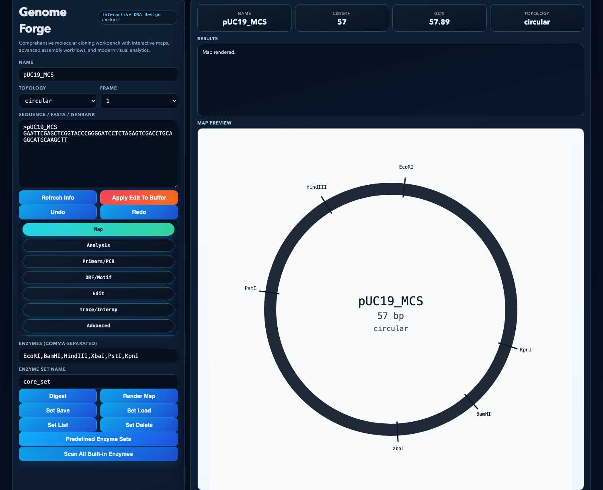
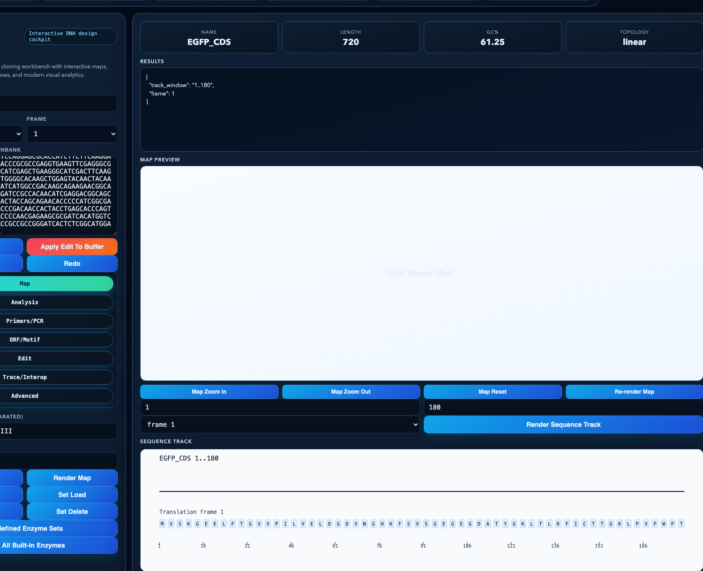
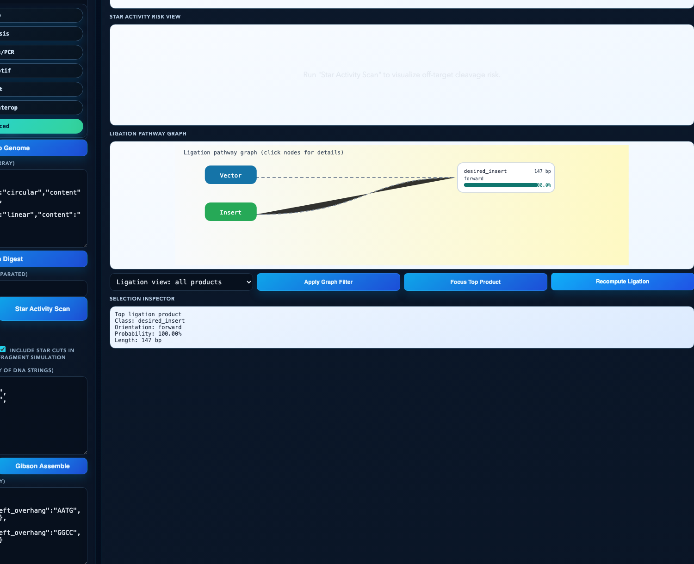
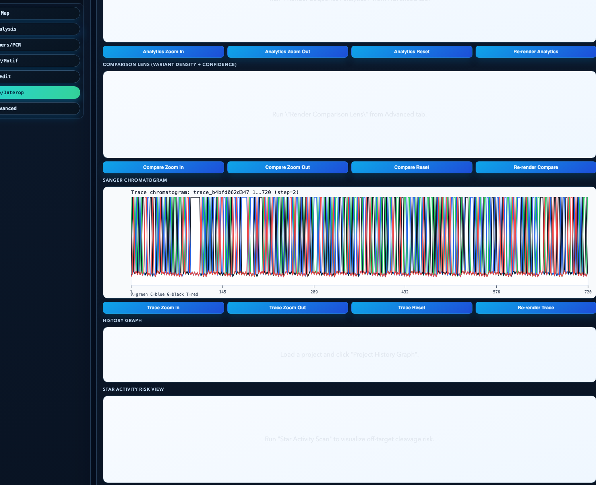
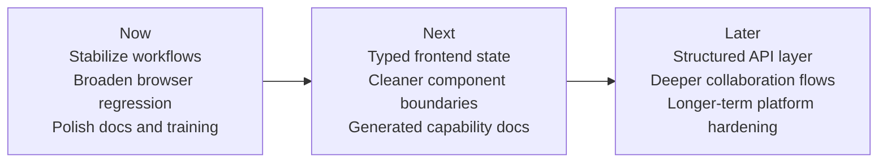

# Genome Forge

<p align="center">
  
  
  
  
</p>

Genome Forge is a local-first DNA design, cloning, validation, and bioinformatics workbench with a modern web UI, reproducible workflows, and real-world training materials.

It combines:

- interactive plasmid and sequence visualization
- cloning and assembly planning
- primer, PCR, trace, and verification workflows
- CRISPR/design-assist tooling
- project history, sharing, and lightweight review
- a 37-case self-study tutorial built on real biological examples

Latest release:

- [Genome Forge v0.1.4](https://github.com/felizvida/genomeforge/releases/tag/v0.1.4)

## Why Genome Forge

Genome Forge is built for practical sequence work across the full “design -> validate -> explain -> hand off” loop:

- plasmid mapping and feature annotation
- restriction digest planning and cloning simulation
- primer design, PCR, and mutagenesis workflows
- alignment, trace review, and construct verification
- CRISPR helper workflows
- reference libraries, auto-flagging, and siRNA design
- project persistence, sharing, audit, and lightweight review workflows

For the full capability and maturity matrix, see [FEATURE_COVERAGE.md](FEATURE_COVERAGE.md).

## Visual Tour

<table>
  <tr>
    <td></td>
    <td></td>
  </tr>
  <tr>
    <td></td>
    <td></td>
  </tr>
</table>

More UI examples are embedded in the training tutorial, including comparison, MSA heatmap, BLAST-like search, and project-history workflows.

## Learn With Real Data

The tutorial package is meant to teach both the software and the biology behind the workflows.

Included training records and case bundles cover examples built around:

- `EGFP` and `mCherry` reporter CDS records
- `pUC19` multiple-cloning-site and `lacZ alpha` cloning logic
- a medically meaningful `BRAF exon 15` hotspot fragment
- clearly labeled derived training variants for comparison and interpretation exercises

Start here:

- [Tutorial HTML](docs/tutorial/user_training_tutorial.html)
- [Tutorial PDF](docs/tutorial/user_training_tutorial.pdf)
- [Training Case Playbook](docs/tutorial/datasets/case_playbook.md)
- [Tutorial Dataset Guide](docs/tutorial/datasets/README.md)

## Quickstart

Run directly from source:

```bash
python3 web_ui.py --port 8080
```

Open:

```text
http://127.0.0.1:8080
```

Recommended editable install:

```bash
python3 -m venv .venv
. .venv/bin/activate
python3 -m pip install --upgrade pip
python3 -m pip install -e ".[dev,bio]"
genomeforge-web --port 8080
```

CLI entry point after install:

```bash
genomeforge input.fasta info
```

## Validation Snapshot

Current shipped baseline:

- `python3 -m unittest discover -s tests -p 'test_*.py'` -> `26/26` passed
- `python3 smoke_test.py` -> `108/108` passed
- `python3 real_world_functional_test.py` -> `97/97` passed
- `npm run test:e2e` -> `12/12` passed

## Documentation

Start with:

- [Docs Index](docs/README.md)
- [Install Guide](docs/INSTALL.md)
- [User Guide](docs/USER_GUIDE.md)
- [Developer Guide](docs/DEVELOPER_GUIDE.md)
- [Architecture](docs/ARCHITECTURE.md)
- [API Reference](docs/API.md)
- [Contributing Guide](CONTRIBUTING.md)
- [Modernization Plan](docs/MODERNIZATION_PLAN.md)
- [Changelog](CHANGELOG.md)

## Community

Ways to engage:

- open an Issue for a reproducible bug or concrete feature request
- start a Discussion for workflow design, usage help, or broader product feedback
- use the [Contributing Guide](CONTRIBUTING.md) for setup, test expectations, and PR discipline

This repo now includes structured GitHub issue forms and discussion prompts tuned for scientific workflow feedback, not just generic software bug reports.

## Roadmap Snapshot



For the fuller engineering roadmap, see [docs/MODERNIZATION_PLAN.md](docs/MODERNIZATION_PLAN.md).

## Common Commands

Run the UI:

```bash
python3 web_ui.py --port 8080
```

Run docs validation:

```bash
python3 docs/validate_docs.py
```

Run focused unit tests:

```bash
python3 -m unittest discover -s tests -p 'test_*.py'
```

Run broad regression:

```bash
python3 smoke_test.py
python3 real_world_functional_test.py
```

If development dependencies are installed:

```bash
python3 -m pytest
```

If browser test dependencies are installed:

```bash
npm run test:e2e
```

## Current Project Shape

- `backend/`: extracted backend workflow domains for record I/O, core sequence workflows, design-assist workflows, trace, search, reference, siRNA, project persistence, sharing, history, cloning/assembly, analysis/alignment, and biology-support workflows such as digest, enzyme, annotation, feature, and gel operations
- `genomeforge_toolkit.py`: sequence engine and CLI
- `web_ui.py`: local HTTP API server and thin dispatch/bootstrap layer
- `webui/`: browser app shell, extracted styles, and extracted frontend scripts
- `bio/`, `compat/`, `collab/`: helper modules
- `smoke_test.py`: broad endpoint regression
- `real_world_functional_test.py`: real-data workflow validation
- `docs/`: product docs, tutorial, release notes, and modernization roadmap

## Scope Notes

- Genome Forge is intentionally local-first.
- Many workflows are practical heuristics rather than proprietary commercial implementations.
- Native proprietary `.dna` import is supported through optional Biopython-backed parsing when available.
- External aligners are optional for adapter-backed multiple-alignment workflows.

## License

Genome Forge is licensed under the Apache License 2.0. See [LICENSE](LICENSE).
